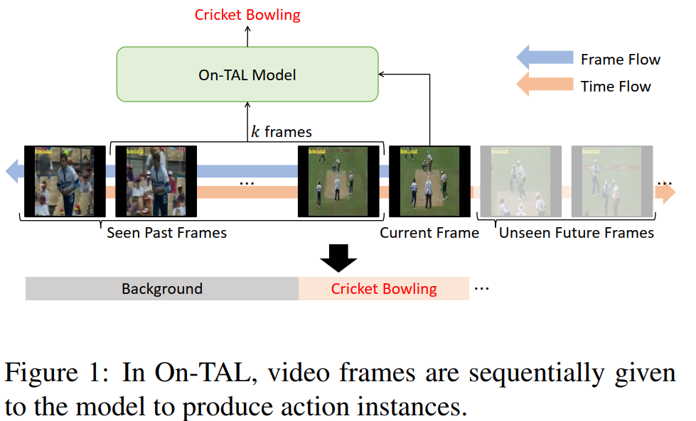
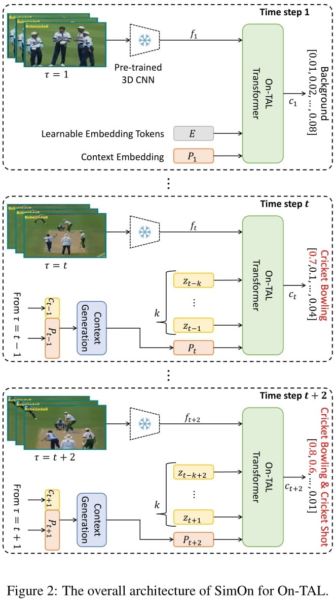
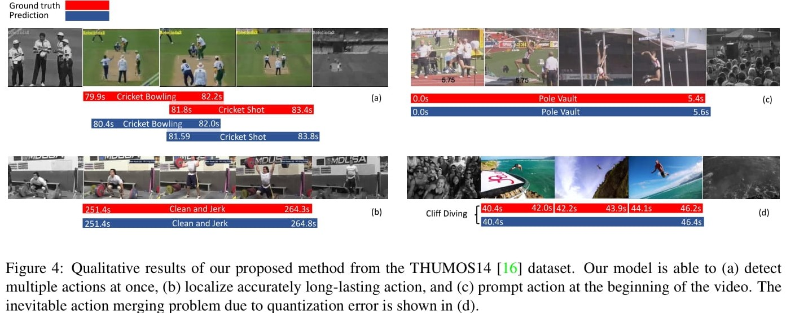

# SimOn: A Simple Framework for Online Temporal Action Localization

This is the official implementation of the paper [SimOn: A Simple Framework for Online Temporal Action Localization](https://arxiv.org/abs/2211.04905). We provide training code for SimOn w/o context generation (P) as it is a part of our future research. The released code is for On-TAL and ODAS tasks on THUMOS14 dataset.

## Table of Contents
1. [Introduction](#introduction)
2. [Installation](#installation)
3. [Dataset](#dataset)
4. [Usage](#usage)
5. [Qualitative results](#qualitative_results)
6. [Citation](#citation)

## Introduction

- Online Temporal Action Localization (On-TAL) aims to immediately provide action instances from untrimmed streaming videos. The model is not allowed to utilize future frames and any processing techniques to modify past predictions, making On-TAL much more challenging.

- Inference result of our proposed method: 

https://user-images.githubusercontent.com/62212814/196906169-b614f43a-90e2-4779-86a3-327600f36a8d.mp4

<div align="center">
  
</div>

- In this paper, we propose a simple yet effective framework, termed SimOn, that learns to predict action instances using the popular Transformer architecture in an end-to-end manner. Specifically, the model takes the current frame feature as a query and a set of past context information as keys and values of the Transformer.

- Different from the prior work that uses a set of outputs of the model as past contexts, we leverage the past visual context and the learnable context embedding for the current query. 

- Experimental results on the THUMOS14 and ActivityNet1.3 datasets show that our model remarkably outperforms the previous methods, achieving a new state-of-the-art On-TAL performance. In addition, the evaluation for Online Detection of Action Start (ODAS) demonstrates the effectiveness and robustness of our method in the online setting.

<div align="center">
  
</div>

## Installation
```bash
# create ananconda env
conda create -n SimOn python=3.7 -y
conda activate SimOn
# install pytorch
conda install pytorch torchvision torchaudio cudatoolkit=11.3 -c pytorch
# install others
pip install future tqdm ipdb mmcv opencv-python pandas 
python setup.py develop
```

## Dataset
- We provide THUMOS14 feature as reported in the paper. Download the dataset from [this link](https://1drv.ms/u/s!AmoaChPnSuIOhHPZKhEz-3OiTsgE?e=m5D5QS). We adopt the extracted feature as well as some pieces of code from [OadTR](https://github.com/wangxiang1230/OadTR).
- Unzip the file and put it under `root`, `/data`. The folder hierarchy should be organized like the following:
```bash
/data/
    ├── thumos14_anet # extracted feature from pre-trained ActivityNet
    │   ├── thumos_all_feature_test_tsn_v2.pickle
    │   ├── thumos_all_feature_val_tsn_v2.pickle
    │   └── thumos_val_anno.pickle
    ├── thumos14_feat # extracted feature from pre-trained TSN
    │   ├── ambiguous_dict.pkl
    │   ├── fps_info.pkl
    │   ├── thumos14.json
    │   ├── thumos_all_feature_test_V3.pickle
    │   ├── thumos_all_feature_val_V3.pickle
    │   ├── thumos_from_oad_multiclasses.pkl
    │   ├── thumos_test_anno_multiclass.pickle
    │   └── thumos_val_anno_multiclass.pickle
```

## Usage
### Train the model
1. To train the On-TAL model on THUMOS14, refer to the following instructions
- The training time is very fast which is around 30 minutes on a single GeForce GTX 1080 Ti GPU.
- To reproduce the results on THUMOS14 in On-TAL, please use the following command:
```bash
./thumos14_kinetics_run_scripts/train.sh
```

2. To train the model in ODAS task, please check out branch `ODAS`

### Test the model
1. Test model in On-TAL task
- To test the model on THUMOS in On-TAL task, use the following command:
```bash
./thumos14_kinetics_run_scripts/test.sh
./thumos14_kinetics_run_scripts/eval_tal_with_pred_oad.sh
```
- The model should give 36.0 mAP the result may fluctuate a little.

2. Test model in ODAS task
- Please check out branch `ODAS` to test the model

## Qualitative results
We provide qualitative results according to the various challenging conditions, including overlapped multiple action instances, long-lasting actions, and promptly started actions. Our model produces confident predictions for overlapped multiple action instances as shown in Fig.4-(a), showing different actions in the same time step can be detected separately. In addition, our model can accomplish to predict relatively long-lasting actions, proving the effectiveness of the context modeling as shown in Fig. 4-(b). The initial learnable parameter enables the model to detect prompt actions at the beginning of the video as shown in Fig. 4-(c).

<div align="center">
  
</div>

## Citation
Please cite the paper in your publications if it helps your research:
```
@article{tang2022simon,
  title={SimOn: A Simple Framework for Online Temporal Action Localization},
  author={Tang, Tuan N and Park, Jungin and Kim, Kwonyoung and Sohn, Kwanghoon},
  journal={arXiv preprint arXiv:2211.04905},
  year={2022}
}
``` 
